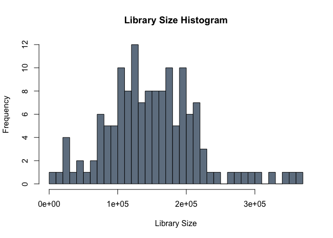
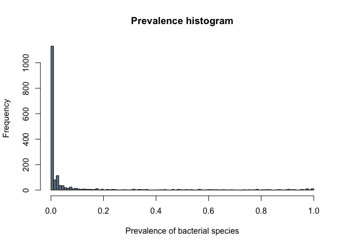
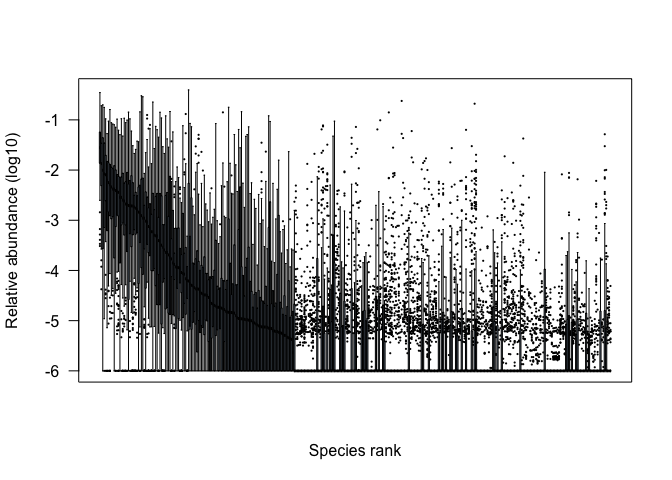
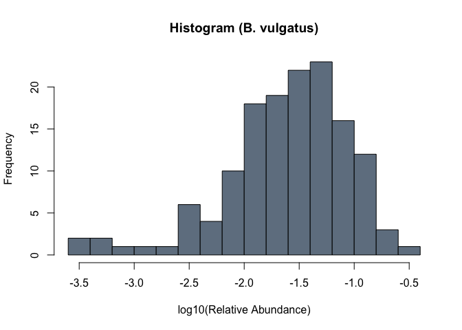
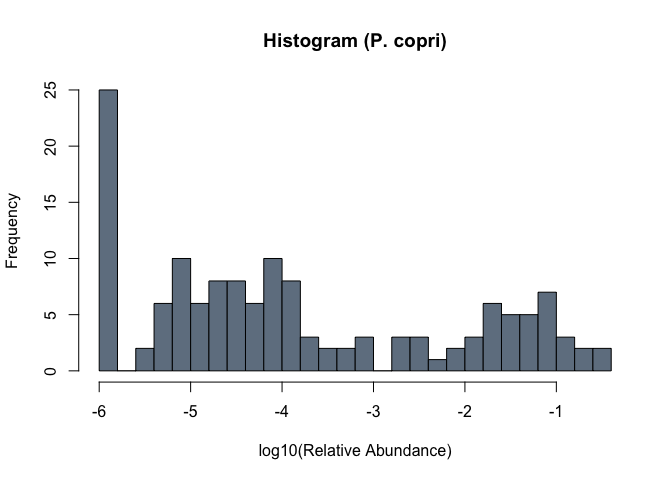
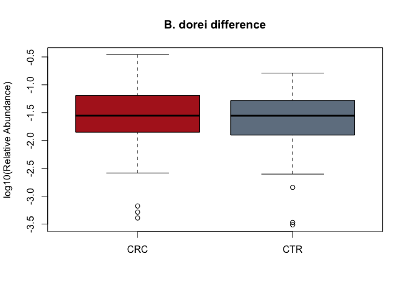
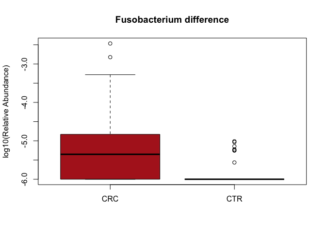

# "AI Applications in Infection Biology"

"Jakob Wirbel and Georg Zeller"
"2024-05-21"

# Setup

In order to get started, we should first prepare our `R` environment and load
the packages we will need later on. Additionally, the data used in this 
practical are stored on [Zenodo](https://zenodo.org/records/7117162) and we 
can set the base path for the downloads.

## Preparing the R environment


```r
library("tidyverse") # for general data wrangling and plotting
library("SIAMCAT")   # for statistical and ML analyses

data.loc <- 'https://zenodo.org/api/files/d81e429c-870f-44e0-a44a-2a4aa541b6c1/'
```

## Loading the data

In this practical, we are going to have a look at the data from
[Zeller et al. _MSB_ 2014](https://doi.org/10.15252/msb.20145645). In this 
study, the authors recruited patients with **colorectal cancer (CRC)** 
and **healthy controls (CTR)** and performed shotgun metagenomic sequencing 
of fecal samples. The raw data have already been pre-processed and analyzed 
with the [mOTUs](https://doi.org/10.1038/s41467-019-08844-4) taxonomic 
profiler.

## Features

First, we are going to load the taxonomic profiles and store them as a matrix.


```r
fn.feat.fr  <- paste0(data.loc, 'specI_Zeller.tsv')
feat.fr  <- read.table(fn.feat.fr, sep='\t', quote="",
    check.names = FALSE, stringsAsFactors = FALSE)
feat.fr <- as.matrix(feat.fr)
```

## Metadata

Additionally, we also need the information which sample belongs to which group.
Therefore, we are loading the metadata table as well:


```r
fn.meta.fr  <- paste0(data.loc, 'meta_Zeller.tsv')
df.meta <- read.table(fn.meta.fr)
df.meta
```

```r
table(df.meta$Group)
```

```
## 
## CRC CTR 
##  53  88
```


## Library size & low-abundance filtering

First, we can have a look at the library size across samples:

```r
options(repr.plot.width=5, repr.plot.height=5)
hist(colSums(feat.fr), 30, col='slategray', 
     main='Library Size Histogram', xlab='Library Size')
```

<!-- -->

The above plots strongly suggests to correct for differences in library size. 
Here we use the simplest approach: conversion to relative abundances (aslo 
known as total sum scaling). Alternatives are rarefying (i.e. downsampling) 
or DESeq's library size normalization...


```r
feat.fr.rel <- prop.table(feat.fr, 2)
```

Next, we can have a look at the prevalence of the bacterial features across
all samples. The assumption would be that features that are present in only
a handful of samples are unlikely to play a major role in the gut
ecosystem and their quantification has the greatest uncertainty.


```r
options(repr.plot.width=8, repr.plot.height=5)
hist(rowMeans(feat.fr.rel != 0), 100, col='slategray',
     xlab='Prevalence of bacterial species', main='Prevalence histogram')
```

<!-- -->

Most of the features are present in none or only a few of the samples and we
can therefore discard them.


```r
f.idx <- names(which(rowMeans(feat.fr.rel != 0) > 0.05))

# remove the Unmapped part as well
f.idx <- setdiff(f.idx, 'UNMAPPED')

feat.fr.rel.filt <- feat.fr.rel[f.idx,]
```

How does the abundance vary across these different bacterial features?


```r
# resize plots in Jupyter Notebook to more convenient dimensions
options(repr.plot.width=8, repr.plot.height=5)

# rank-abundance plot
rnk <- order(apply(feat.fr.rel.filt, 1, median), decreasing=TRUE)
boxplot(log10(t(feat.fr.rel.filt[rnk,]) + 1E-6), las=2, cex=0.3, pch=16, lty=1,
        col='slategray', 
        xlab='Species rank', ylab='Relative abundance (log10)', xaxt='n')
```

<!-- -->

Let's take two examples and visualize them. The top feature is 
_Bacteroides dorei_/ _Bacteroides vulgatus_:


```r
 # resize plots in Jupyter Notebook to more convenient dimensions
options(repr.plot.width=5, repr.plot.height=5)

# one of the most abundant species
hist(log10(feat.fr.rel.filt[40,] + 1E-6), 20,
     col='slategray', main='Histogram (B. vulgatus)', 
     xlab='log10(Relative Abundance)')
```

<!-- -->

A bacterium with a more bi-modal distribution is _Prevotella copri_:

```r
 # resize plots in Jupyter Notebook to more convenient dimensions
options(repr.plot.width=5, repr.plot.height=5)

# one of the most abundant species
hist(log10(feat.fr.rel.filt[20,] + 1E-6), 20,
     col='slategray', main='Histogram (P. copri)', 
     xlab='log10(Relative Abundance)')
```

<!-- -->

# Association Testing

Now that we have set up everything, we can test all microbial species 
for statistically significant differences between the `CTR` and `CRC` groups. 
In order to do so, we perform a Wilcoxon test on each individual 
bacterial species. Let's start with one of the species:


```r
x <- feat.fr.rel.filt[40,]
y <- df.meta$Group
wilcox.test(x~y)
```

```
## 
## 	Wilcoxon rank sum test with continuity correction
## 
## data:  x by y
## W = 2436, p-value = 0.6595
## alternative hypothesis: true location shift is not equal to 0
```

The result seems to be that there is no significant difference in the relative
abundance of _Bacteroides dorei/vulgatus_ between these two groups. We can also
visualize this with a boxplot:


```r
boxplot(log10(x+1E-06)~y, xlab='', ylab='log10(Relative Abundance)',
        main='B. dorei difference', col=c('firebrick', 'slategrey'))
```

<!-- -->

Now, we can just run this test for all individual bacteria:


```r
p.vals <- rep_len(1, nrow(feat.fr.rel.filt))
names(p.vals) <- rownames(feat.fr.rel.filt)
stopifnot(all(rownames(df.meta) == colnames(feat.fr.rel.filt)))
for (i in rownames(feat.fr.rel.filt)){
  x <- feat.fr.rel.filt[i,]
  y <- df.meta$Group
  t <- wilcox.test(x~y)
  p.vals[i] <- t$p.value
}
head(sort(p.vals))
```

```
##      unclassified Fusobacterium [Cluster1482] 
##                                  3.370035e-10 
##      unclassified Fusobacterium [Cluster1481] 
##                                  2.042310e-08 
## Pseudoflavonifractor capillosus [Cluster1579] 
##                                  2.749302e-06 
##         Fusobacterium nucleatum [Cluster1479] 
##                                  1.316326e-05 
##   Porphyromonas asaccharolytica [Cluster1056] 
##                                  1.914120e-05 
##           Prevotella nigrescens [Cluster1069] 
##                                  5.114510e-05
```

The species with the most significant effect seems to be a 
_Fusobacterium_ species, so let us take a look at 
the distribution of this species:


```r
x <- feat.fr.rel.filt['unclassified Fusobacterium [Cluster1482]',]
boxplot(log10(x+1E-06)~y, xlab='', ylab='log10(Relative Abundance)',
        main='Fusobacterium difference', col=c('firebrick', 'slategrey'))
```

<!-- -->


# Machine Learning with SIAMCAT

Today, we will use the `SIAMCAT` package to train machine learning models
on microbiome data. All the data are stored in the `SIAMCAT` object which 
contains the feature matrix, the metadata, and information about the 
groups you want to compare.


```r
sc.obj <- siamcat(feat=feat.fr.rel, meta=df.meta, 
                  label='Group', case='CRC')
```

```
## + starting create.label
```

```
## Label used as case:
##    CRC
## Label used as control:
##    CTR
```

```
## + finished create.label.from.metadata in 0.015 s
```

```
## + starting validate.data
```

```
## +++ checking overlap between labels and features
```

```
## + Keeping labels of 141 sample(s).
```

```
## +++ checking sample number per class
```

```
## +++ checking overlap between samples and metadata
```

```
## + finished validate.data in 0.025 s
```

We can use `SIAMCAT` for feature filtering as well:


```r
sc.obj <- filter.features(sc.obj, filter.method = 'prevalence', cutoff = 0.05)
```

```
## Features successfully filtered
```

```r
sc.obj
```

```
## siamcat-class object
## label()                Label object:         88 CTR and 53 CRC samples
## filt_feat()            Filtered features:    358 features after prevalence filtering
## 
## contains phyloseq-class experiment-level object @phyloseq:
## phyloseq@otu_table()   OTU Table:            [ 1754 taxa and 141 samples ]
## phyloseq@sam_data()    Sample Data:          [ 141 samples by 5 sample variables ]
```


## Normalization

`SIAMCAT` offers a few normalization approaches that can be useful for
subsequent statistical modeling in the sense that they transform features in
a way that can increase the accuracy of the resulting models. Importantly,
these normalization techniques do not make use of any label information
(patient status), and can thus be applied up front to the whole data set 
(and outside of the following cross validation).


```r
sc.obj <- normalize.features(sc.obj, norm.method = 'log.std',
                             norm.param = list(log.n0=1e-06, sd.min.q=0))
```

```
## Features normalized successfully.
```

```r
sc.obj
```

```
## siamcat-class object
## label()                Label object:         88 CTR and 53 CRC samples
## filt_feat()            Filtered features:    358 features after prevalence filtering
## norm_feat()            Normalized features:  358 features normalized using log.std
## 
## contains phyloseq-class experiment-level object @phyloseq:
## phyloseq@otu_table()   OTU Table:            [ 1754 taxa and 141 samples ]
## phyloseq@sam_data()    Sample Data:          [ 141 samples by 5 sample variables ]
```


## Cross Validation Split

Cross validation is a technique to assess how well an ML model would generalize 
to external data by partionining the dataset into training and test sets.
Here, we split the dataset into 10 parts and then train a model on 9 of these
parts and use the left-out part to test the model. The whole process is 
repeated 10 times.


```r
sc.obj <- create.data.split(sc.obj, num.folds = 10, num.resample = 10)
```

```
## Features splitted for cross-validation successfully.
```


## Model Training

Now, we can train a
[LASSO logistic regression classifier](https://www.jstor.org/stable/2346178)
in order to distinguish CRC cases and controls.


```r
sc.obj <- train.model(sc.obj, method='lasso')
```

```
## Trained lasso models successfully.
```


## Predictions

This function will automatically apply the models trained in cross validation 
to their respective test sets and aggregate the predictions across the whole 
data set.


```r
sc.obj <- make.predictions(sc.obj)
```

```
## Made predictions successfully.
```

## Model Evaluation

Calling the `evaluate.predictions` function will result in an assessment of
precision and recall as well as in ROC analysis, both of which can be plotted
as a pdf file using the `model.evaluation.plot` function (the name of/path to
the pdf file is passed as an argument).


```r
sc.obj <- evaluate.predictions(sc.obj)
```

```
## Evaluated predictions successfully.
```

```r
model.evaluation.plot(sc.obj, fn.plot = './figures/eval_plot.pdf')
```

```
## Plotted evaluation of predictions successfully to: ./figures/eval_plot.pdf
```


## Model Interpretation

Finally, the `model.interpretation.plot` function will plot characteristics 
of the models (i.e. model coefficients or feature importance) alongside the 
input data aiding in understanding how / why the model works (or not).


```r
model.interpretation.plot(sc.obj, consens.thres = 0.7,
                          fn.plot = './figures/interpretation_plot.pdf')
```

```
## Successfully plotted model interpretation plot to: ./figures/interpretation_plot.pdf
```


# Exercises

## Data visualization

* What could be a good effect size for microbiome data? Calculate the fold
change between groups and plot a volcano plot. What do you observe?

* You can perform association testing with the `SIAMCAT` package as well. The
results are stored in the `SIAMCAT` object and can be extracted by using
`associations(sc.obj)`, if you want to have a closer look at the results for
yourself. Plot a volcano plot of the associations between cancer and controls 
using the output from `SIAMCAT`.

* **Optional** Create a ordination plot for our data and colour the samples 
by group. How would you interpret the results? Try out different ecological 
distances. How does the choice of distance affect the group separation?
(**Tip**: make sure to check out the `vegdist` function in the **vegan** 
package and also the `pco` function in the **labdsv** package)

## Machine learning variations

* We used the `log.std` normalization for our example. Try out different 
normalization procedures and observe the effect on model performance

* How does the model performance change if you use another machine learning
algorithm? Do the different algorithms select different features?

## Predictions on external data

The same Zenodo repository also contains data from another CRC microbiome study
by [Yu et al.](https://gut.bmj.com/content/66/1/70.short). The participants for
this study were recruited in Austria, so you can read in the data by using 
these paths to the data:

```r
fn.meta.at  <- paste0(data.loc, 'meta_Yu.tsv')
fn.feat.at  <- paste0(data.loc, 'specI_Yu.tsv')
```

* Apply the trained model on this dataset and check the model performance 
on the external dataset. (**Tip**: Check out the help for the `make.prediction`
function in `SIAMCAT`)

* Train a `SIAMCAT` model on the Austrian dataset and apply it to the French 
dataset. How does the model transfer on the external dataset compare between
the two datasets? Compare also the feature weights when training on the French
or Austrian dataset.  
**Note**: You can supply several `SIAMCAT` objects to the function 
`model.evaluation.plot` and compare two ROC curves in the same plot.

## Another disease

If you are way too fast and have too much time, the Zenodo repository also 
contains data for several studies investigating the microbiome in Crohn's 
disease patients (`CD`). Explore the (meta)-data first, then try to build ML 
models for each study and check how well they can be transferred to the other
datasets. 
Since this exercise is a bit more exploratory, there will be no solution for it
in this Github repository, but you can check out the 
[SIAMCAT vignette](https://siamcat.embl.de/articles/SIAMCAT_meta.html) and
the [SIAMCAT publication](https://genomebiology.biomedcentral.com/articles/10.1186/s13059-021-02306-1) 
for some reference (especially Figures 2, 3, and 6).

# Further Information

You can find more information about `SIAMCAT` on https://siamcat.embl.de 
or on Bioconductor under 
https://www.bioconductor.org/packages/release/bioc/html/SIAMCAT.html

There you can also find several vignettes which go into more detail about 
different applications for `SIAMCAT`.

# SessionInfo


```r
sessionInfo()
```

```
## R version 4.2.2 (2022-10-31)
## Platform: x86_64-apple-darwin17.0 (64-bit)
## Running under: macOS Big Sur ... 10.16
## 
## Matrix products: default
## BLAS:   /Library/Frameworks/R.framework/Versions/4.2/Resources/lib/libRblas.0.dylib
## LAPACK: /Library/Frameworks/R.framework/Versions/4.2/Resources/lib/libRlapack.dylib
## 
## locale:
## [1] en_US.UTF-8/en_US.UTF-8/en_US.UTF-8/C/en_US.UTF-8/en_US.UTF-8
## 
## attached base packages:
## [1] stats     graphics  grDevices utils     datasets  methods   base     
## 
## other attached packages:
##  [1] SIAMCAT_2.5.0   phyloseq_1.42.0 mlr3_0.16.0     lubridate_1.9.2
##  [5] forcats_1.0.0   stringr_1.5.0   dplyr_1.1.2     purrr_1.0.1    
##  [9] readr_2.1.4     tidyr_1.3.0     tibble_3.2.1    ggplot2_3.4.2  
## [13] tidyverse_2.0.0
## 
## loaded via a namespace (and not attached):
##   [1] paradox_0.11.1         minqa_1.2.5            colorspace_2.1-0      
##   [4] XVector_0.38.0         rstudioapi_0.14        farver_2.1.1          
##   [7] listenv_0.9.0          mlr3tuning_0.18.0      fansi_1.0.4           
##  [10] codetools_0.2-19       splines_4.2.2          mlr3learners_0.5.6    
##  [13] PRROC_1.3.1            cachem_1.0.7           knitr_1.42            
##  [16] ade4_1.7-22            jsonlite_1.8.4         nloptr_2.0.3          
##  [19] pROC_1.18.2            gridBase_0.4-7         cluster_2.1.4         
##  [22] compiler_4.2.2         backports_1.4.1        Matrix_1.5-4          
##  [25] fastmap_1.1.1          cli_3.6.1              prettyunits_1.1.1     
##  [28] htmltools_0.5.5        tools_4.2.2            lmerTest_3.1-3        
##  [31] igraph_1.4.2           gtable_0.3.3           glue_1.6.2            
##  [34] GenomeInfoDbData_1.2.9 reshape2_1.4.4         LiblineaR_2.10-22     
##  [37] Rcpp_1.0.10            Biobase_2.58.0         jquerylib_0.1.4       
##  [40] vctrs_0.6.4            Biostrings_2.66.0      rhdf5filters_1.10.1   
##  [43] multtest_2.54.0        ape_5.7-1              nlme_3.1-162          
##  [46] iterators_1.0.14       xfun_0.39              mlr3measures_0.5.0    
##  [49] globals_0.16.2         lme4_1.1-33            timechange_0.2.0      
##  [52] lifecycle_1.0.3        beanplot_1.3.1         future_1.32.0         
##  [55] zlibbioc_1.44.0        MASS_7.3-59            scales_1.2.1          
##  [58] lgr_0.4.4              hms_1.1.3              parallel_4.2.2        
##  [61] biomformat_1.26.0      rhdf5_2.42.1           RColorBrewer_1.1-3    
##  [64] yaml_2.3.7             gridExtra_2.3          sass_0.4.5            
##  [67] stringi_1.7.12         highr_0.10             S4Vectors_0.36.2      
##  [70] corrplot_0.92          foreach_1.5.2          checkmate_2.2.0       
##  [73] permute_0.9-7          palmerpenguins_0.1.1   BiocGenerics_0.44.0   
##  [76] boot_1.3-28.1          shape_1.4.6            GenomeInfoDb_1.34.9   
##  [79] matrixStats_0.63.0     rlang_1.1.1            pkgconfig_2.0.3       
##  [82] bitops_1.0-7           evaluate_0.21          lattice_0.21-8        
##  [85] Rhdf5lib_1.20.0        tidyselect_1.2.0       parallelly_1.35.0     
##  [88] plyr_1.8.8             magrittr_2.0.3         R6_2.5.1              
##  [91] IRanges_2.32.0         generics_0.1.3         DBI_1.1.3             
##  [94] pillar_1.9.0           withr_2.5.0            mgcv_1.8-42           
##  [97] survival_3.5-5         RCurl_1.98-1.12        crayon_1.5.2          
## [100] uuid_1.1-0             utf8_1.2.3             tzdb_0.3.0            
## [103] rmarkdown_2.21         progress_1.2.2         grid_4.2.2            
## [106] data.table_1.14.8      vegan_2.6-4            infotheo_1.2.0.1      
## [109] mlr3misc_0.12.0        bbotk_0.7.2            digest_0.6.31         
## [112] numDeriv_2016.8-1.1    stats4_4.2.2           munsell_0.5.0         
## [115] glmnet_4.1-7           bslib_0.4.2
```
