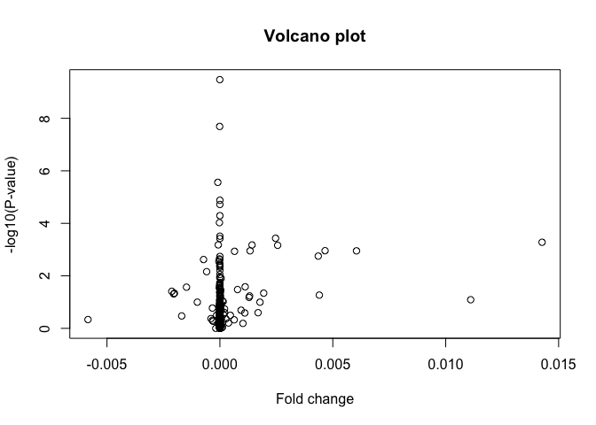
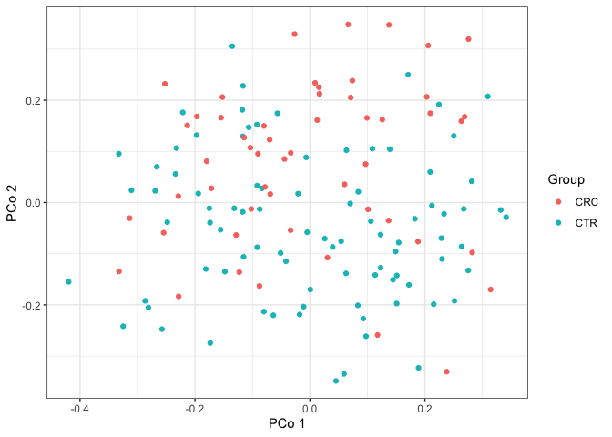
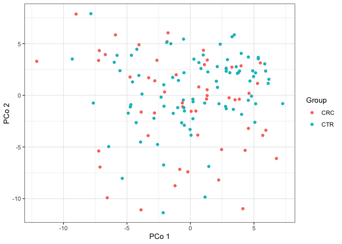
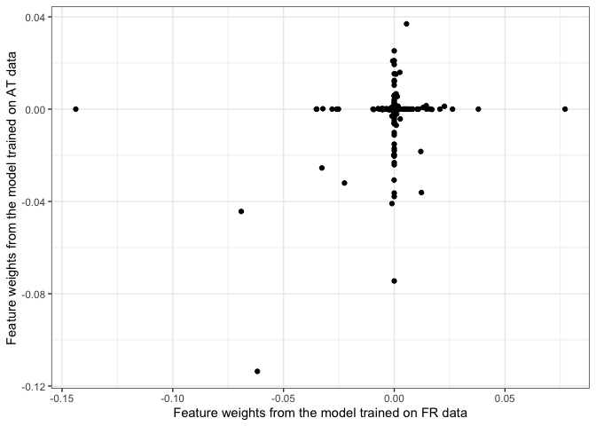

# Setup

First, we have to load the same packages and data.


```r
library("tidyverse") # for general data wrangling and plotting
library("SIAMCAT")   # for statistical and ML analyses

data.loc <- 'https://zenodo.org/api/files/d81e429c-870f-44e0-a44a-2a4aa541b6c1/'
fn.feat.fr  <- paste0(data.loc, 'specI_Zeller.tsv')
feat.fr  <- read.table(fn.feat.fr, sep='\t', quote="",
    check.names = FALSE, stringsAsFactors = FALSE)
feat.fr <- as.matrix(feat.fr)
feat.fr.rel <- prop.table(feat.fr, 2)
fn.meta.fr  <- paste0(data.loc, 'meta_Zeller.tsv')
df.meta <- read.table(fn.meta.fr)
```

We will also re-train the model quickly to have it available for the later
exercises:

```r
sc.obj <- siamcat(feat=feat.fr.rel, meta=df.meta, 
                  label='Group', case='CRC')
sc.obj <- filter.features(sc.obj, filter.method = 'prevalence', cutoff = 0.05)
sc.obj <- normalize.features(sc.obj, norm.method = 'log.std',
                             norm.param = list(log.n0=1e-06, sd.min.q=0))
sc.obj <- create.data.split(sc.obj, num.folds = 10, num.resample = 10)
sc.obj <- train.model(sc.obj, method='lasso')
sc.obj <- make.predictions(sc.obj)
sc.obj <- evaluate.predictions(sc.obj)
```

# Exercise block 1: Data visualization

## Exercise 1-1

> What could be a good effect size for microbiome data? Calculate the fold
change between groups and plot a volcano plot. What do you observe?

First, let's re-calculate the p-values as before


```r
feat.fr.rel <- prop.table(feat.fr, 2)
f.idx <- names(which(rowMeans(feat.fr.rel != 0) > 0.05))
f.idx <- setdiff(f.idx, 'UNMAPPED')
feat.fr.rel.filt <- feat.fr.rel[f.idx,]
p.vals <- rep_len(1, nrow(feat.fr.rel.filt))
names(p.vals) <- rownames(feat.fr.rel.filt)
stopifnot(all(rownames(df.meta) == colnames(feat.fr.rel.filt)))
for (i in rownames(feat.fr.rel.filt)){
  x <- feat.fr.rel.filt[i,]
  y <- df.meta$Group
  t <- wilcox.test(x~y)
  p.vals[i] <- t$p.value
}
```

Now, we can compute the fold change between groups in a similar way:

```r
fc_values <- rep_len(0, nrow(feat.fr.rel.filt))
names(fc_values) <- rownames(feat.fr.rel.filt)
stopifnot(all(rownames(df.meta) == colnames(feat.fr.rel.filt)))
for (i in rownames(feat.fr.rel.filt)){
  x <- feat.fr.rel.filt[i,]
  med.ctr <- median(x[rownames(df.meta[df.meta$Group=='CTR',])])
  med.crc <- median(x[rownames(df.meta[df.meta$Group=='CRC',])])
  fc_values[i] <- med.ctr - med.crc
}
```

Now we can plot a volcano plot:

```r
plot(fc_values, -log10(p.vals), xlab='Fold change',
     ylab='-log10(P-value)', main='Volcano plot')
```

<!-- -->

Interestingly, the median fold change seems a poor effect size estimator in
microbiome data. Many of the bacteria with significant changes between the 
groups have a fold change of 0, because they are relatively rare in either 
group (see also the `Fusobacterium` relative abundance plot from the lesson). 
In the next exercise, we will explore the generalized fold change
that is used in `SIAMCAT`.

## Exercise 1-2

> You can perform association testing with the `SIAMCAT` package as well. The
results are stored in the `SIAMCAT` object and can be extracted by using
`associations(sc.obj)`, if you want to have a closer look at the results for
yourself. Plot a volcano plot of the associations between cancer and controls 
using the output from `SIAMCAT`.


```r
sc.obj <- check.associations(sc.obj)
head(associations(sc.obj))
```

<div data-pagedtable="false">
  <script data-pagedtable-source type="application/json">
{"columns":[{"label":[""],"name":["_rn_"],"type":[""],"align":["left"]},{"label":["fc"],"name":[1],"type":["dbl"],"align":["right"]},{"label":["p.val"],"name":[2],"type":["dbl"],"align":["right"]},{"label":["auc"],"name":[3],"type":["dbl"],"align":["right"]},{"label":["auc.ci.l"],"name":[4],"type":["dbl"],"align":["right"]},{"label":["auc.ci.h"],"name":[5],"type":["dbl"],"align":["right"]},{"label":["pr.shift"],"name":[6],"type":["dbl"],"align":["right"]},{"label":["pr.n"],"name":[7],"type":["dbl"],"align":["right"]},{"label":["pr.p"],"name":[8],"type":["dbl"],"align":["right"]},{"label":["p.adj"],"name":[9],"type":["dbl"],"align":["right"]}],"data":[{"1":"0.05020439","2":"0.8218616988","3":"0.5098628","4":"0.4233536","5":"0.5963719","6":"-0.005145798","7":"0.36363636","8":"0.3584906","9":"0.94303362","_rn_":"Victivallis vadensis [Cluster1000]"},{"1":"0.25124139","2":"0.3923786649","3":"0.5430961","4":"0.4433002","5":"0.6428920","6":"0.019511149","7":"0.82954545","8":"0.8490566","9":"0.75994503","_rn_":"Akkermansia muciniphila [Cluster1008]"},{"1":"0.08256590","2":"0.2979868385","3":"0.5525300","4":"0.4493401","5":"0.6557199","6":"0.045454545","7":"0.95454545","8":"1.0000000","9":"0.68825347","_rn_":"Alistipes shahii [Cluster1052]"},{"1":"0.22040348","2":"0.1684957588","3":"0.5694683","4":"0.4710378","5":"0.6678987","6":"0.026586621","7":"0.95454545","8":"0.9811321","9":"0.52001277","_rn_":"unnamed Alistipes sp. HGB5 [Cluster1053]"},{"1":"0.12267372","2":"0.3371171232","3":"0.5484563","4":"0.4464730","5":"0.6504395","6":"0.003859348","7":"0.97727273","8":"0.9811321","9":"0.72367359","_rn_":"Alistipes putredinis [Cluster1054]"},{"1":"0.47341562","2":"0.0000191412","3":"0.6410806","4":"0.5708460","5":"0.7113153","6":"0.271440823","7":"0.06818182","8":"0.3396226","9":"0.00137051","_rn_":"Porphyromonas asaccharolytica [Cluster1056]"}],"options":{"columns":{"min":{},"max":[10]},"rows":{"min":[10],"max":[10]},"pages":{}}}
  </script>
</div>

```r
volcano.plot(sc.obj, fn.plot='../figures/volcano.pdf')
```


The generalized fold change has a better resolution for differences between
the groups, with the `Fusobacterium` species all displaying large fold changes.

## Exercise 1-3

> Create a ordination plot for our data and colour the samples 
by group. How would you interpret the results? Try out different ecological 
distances. How does the choice of distance affect the group separation?


```r
library("vegan")  # for distance calculations
library("labdsv") # easy pco functions

bc.dist <- vegdist(t(feat.fr[rownames(feat.fr.rel.filt),]), method='bray')
pco.res <- pco(bc.dist)
df.pco <- as.data.frame(pco.res$points)
df.pco$Group <- df.meta[rownames(df.pco), 'Group']
df.pco %>% 
  ggplot(aes(x=V1, y=V2, col=Group)) + 
    geom_point() + 
    xlab('PCo 1') + ylab("PCo 2") + 
    theme_bw()
```

<!-- -->

In the global "bird's-eye" view of the data, there does not seem to be a big
difference between the two groups. Note that the visible differences in the 
PCOA are usually driven by the most abundant features (such as _B dorei_) and 
these seem to not be very different between CRC and CTR.

Alternatively, we can also have a look at the log-Euclidean distance (instead
of the more traditional Bray-Curtis distance), which gives a very similar 
result:


```r
logE.dist <- vegdist(t(log10(feat.fr.rel.filt + 1e-06)), 
                     method='euclidean')
pco.res <- pco(logE.dist)
df.pco <- as.data.frame(pco.res$points)
df.pco$Group <- df.meta[rownames(df.pco), 'Group']
df.pco %>% 
  ggplot(aes(x=V1, y=V2, col=Group)) + 
    geom_point() + 
    xlab('PCo 1') + ylab("PCo 2") + 
    theme_bw()
```

<!-- -->

# Exercise block 2: Machine learning variations

## Exercise 2-1
>We used the `log.std` normalization for our example. Try out different 
normalization procedures and observe the effect on model performance

## Exercise 2-2
>How does the model performance change if you use another machine learning
algorithm? Do the different algorithms select different features?

We can answer both of these questions together by exploring the impact of 
various normalization and machine learning algorithm choices together. We
will change the cross-validation a bit, since training all of these models
will take a long time otherwise:

**Warning** this takes quite a while to run! Especially the `randomForest` is
rather slow


```r
sc.obj.ml <- sc.obj
sc.obj.ml <- create.data.split(sc.obj.ml, num.folds = 5, num.resample = 5)
result.list <- list()
for (norm in c('log.std', 'std', 'pass', 'log.unit')){
  for (ml.method in c('lasso', 'ridge', 'randomForest')){
    message(norm, '-', ml.method)
    sc.obj.active <- sc.obj.ml
    sc.obj.active <- normalize.features(
      sc.obj.active, norm.method = norm,
      norm.param = list(log.n0=1e-06, sd.min.q=0, n.p=2, norm.margin=1),
      verbose = 0)
    sc.obj.active <- train.model(sc.obj.active, method=ml.method, verbose = 1)
    sc.obj.active <- make.predictions(sc.obj.active, verbose = 0)
    sc.obj.active <- evaluate.predictions(sc.obj.active, verbose = 0)
    result.list[[paste0(norm, '_', ml.method)]] <- sc.obj.active
  }
}
```

Now we can compare the AUROC values for each combination of ML algorithm and
normalization procedure:

```r
df.plot <- map(names(result.list), .f=function(x){
  tibble(type=x, auroc=as.numeric(eval_data(result.list[[x]])$auroc))}) %>%
  bind_rows() %>% 
  separate(type, into=c('norm', 'ml.method'), sep='_')
df.plot %>% 
  mutate(l=sprintf('%.2f', auroc)) %>% 
  ggplot(aes(x=norm, y=ml.method, fill=auroc)) + 
    geom_tile() + theme_minimal() + 
    xlab('Normalization method') + ylab('ML algorithm') + 
    scale_fill_gradientn(colours=viridis::viridis(7), limits=c(0.5, 1)) + 
    geom_text(aes(label=l))
```


You can explore the selected features by going through the list and looking at 
the model interpretation plots.

# Exercise block 3: Predictions on external data

The same Zenodo repository also contains data from another CRC microbiome study
by [Yu et al.](https://gut.bmj.com/content/66/1/70.short). The participants for
this study were recruited in Austria, so you can read in the data by using 
these paths to the data:

```r
fn.meta.at  <- paste0(data.loc, 'meta_Yu.tsv')
fn.feat.at  <- paste0(data.loc, 'specI_Yu.tsv')
```

## Exercise 3-1
>Apply the trained model on this dataset and check the model performance 
on the external dataset.

For this, we first build a new SIAMCAT object for the external data and can 
then apply the original model to it. Note that we don't need to filter it
because SIAMCAT will use only those features present in the original model.


```r
feat.at  <- read.table(fn.feat.at, sep='\t', quote="",
    check.names = FALSE, stringsAsFactors = FALSE)
feat.at <- as.matrix(feat.at)
feat.at.rel <- prop.table(feat.at, 2)
df.meta.at <- read.table(fn.meta.at)
sc.obj.at <- siamcat(feat = feat.at.rel, meta=df.meta.at, label='Group',
                     case='CRC')
```

```
## + starting create.label
```

```
## Label used as case:
##    CRC
## Label used as control:
##    CTR
```

```
## + finished create.label.from.metadata in 0.002 s
```

```
## + starting validate.data
```

```
## +++ checking overlap between labels and features
```

```
## + Keeping labels of 128 sample(s).
```

```
## +++ checking sample number per class
```

```
## +++ checking overlap between samples and metadata
```

```
## + finished validate.data in 0.024 s
```

```r
sc.obj.at.ext <- make.predictions(sc.obj, siamcat.holdout = sc.obj.at)
```

```
## Features normalized successfully.
```

```
## Made predictions successfully.
```

```r
sc.obj.at.ext <- evaluate.predictions(sc.obj.at.ext)
```

```
## Evaluated predictions successfully.
```

```r
sc.obj.at.ext
```

```
## siamcat-class object
## label()                Label object:         54 CTR and 74 CRC samples
## norm_feat()            Normalized features:  358 features normalized using log.std
## pred_matrix()          Prediction matrix:    Predictions for 128 samples from 100 cv rounds
## eval_data()            Evaluation data:      Average AUC: 0.849
## 
## contains phyloseq-class experiment-level object @phyloseq:
## phyloseq@otu_table()   OTU Table:            [ 1754 taxa and 128 samples ]
## phyloseq@sam_data()    Sample Data:          [ 128 samples by 3 sample variables ]
```
The model performs pretty well on the new data with an AUROC of ~0.85

## Exercise 3-2
>Train a `SIAMCAT` model on the Austrian dataset and apply it to the French 
dataset. How does the model transfer on the external dataset compare between
the two datasets? Compare also the feature weights when training on the French
or Austrian dataset.  


```r
sc.obj.at <- filter.features(sc.obj.at, 
                             filter.method = 'prevalence', cutoff = 0.05)
```

```
## Features successfully filtered
```

```r
sc.obj.at <- normalize.features(sc.obj.at, norm.method = 'log.std',
                             norm.param = list(log.n0=1e-06, sd.min.q=0))
```

```
## Features normalized successfully.
```

```r
sc.obj.at <- create.data.split(sc.obj.at, num.folds = 10, num.resample = 10)
```

```
## Features splitted for cross-validation successfully.
```

```r
sc.obj.at <- train.model(sc.obj.at, method='lasso')
```

```
## Trained lasso models successfully.
```

```r
sc.obj.at <- make.predictions(sc.obj.at)
```

```
## Made predictions successfully.
```

```r
sc.obj.at <- evaluate.predictions(sc.obj.at)
```

```
## Evaluated predictions successfully.
```

```r
model.evaluation.plot('FR'=sc.obj, 'AT'=sc.obj.at, 
                      fn.plot = '../figures/eval_at_fr.pdf')
```

```
## Plotted evaluation of predictions successfully to: ../figures/eval_at_fr.pdf
```


We can also apply this new model to the original French data:

```r
sc.obj.fr.ext <- make.predictions(sc.obj.at, sc.obj)
```

```
## Features normalized successfully.
```

```
## Made predictions successfully.
```

```r
sc.obj.fr.ext <- evaluate.predictions(sc.obj.fr.ext)
```

```
## Evaluated predictions successfully.
```

```r
model.evaluation.plot('FR'=sc.obj, 'AT'=sc.obj.at, 
                      'AT-->FR'=sc.obj.fr.ext,
                      'FR-->AT'=sc.obj.at.ext,
                      fn.plot = '../figures/eval_cross_application.pdf')
```

```
## Plotted evaluation of predictions successfully to: ../figures/eval_cross_application.pdf
```


The models, in general, transfer well across datasets. However, the model 
trained on the AT data does show a decrease in performance on the FR data and
generalizes less well. 
The feature weights are --surprisingly-- pretty different between the two 
datasets:


```r
weights.fr <- feature_weights(sc.obj)
weights.at <- feature_weights(sc.obj.at)

# combine both feature weight information and plot as scatter
df.plot <- weights.fr %>% 
  as_tibble(rownames='feature') %>% 
  select(feature, mean.rel.weight) %>% 
  rename(weights_fr=mean.rel.weight) %>% 
  full_join(weights.at %>% 
    as_tibble(rownames='feature') %>% 
    select(feature, mean.rel.weight) %>% 
    rename(weights_at=mean.rel.weight), by='feature') %>% 
  # fill in NAs
  mutate(weights_fr=replace_na(weights_fr, 0)) %>% 
  mutate(weights_at=replace_na(weights_at, 0))
df.plot %>% 
  ggplot(aes(x=weights_fr, y=weights_at)) + 
    geom_point() + 
    theme_bw() + 
    xlab("Feature weights from the model trained on FR data") + 
    ylab("Feature weights from the model trained on AT data")
```

<!-- -->

```r
df.plot %>% 
  arrange(weights_fr) %>% head
```

<div data-pagedtable="false">
  <script data-pagedtable-source type="application/json">
{"columns":[{"label":["feature"],"name":[1],"type":["chr"],"align":["left"]},{"label":["weights_fr"],"name":[2],"type":["dbl"],"align":["right"]},{"label":["weights_at"],"name":[3],"type":["dbl"],"align":["right"]}],"data":[{"1":"unclassified Fusobacterium [Cluster1482]","2":"-0.14378788","3":"0.00000000"},{"1":"unclassified Fusobacterium [Cluster1481]","2":"-0.06908217","3":"-0.04432089"},{"1":"Peptostreptococcus stomatis [Cluster1530]","2":"-0.06178750","3":"-0.11364140"},{"1":"Desulfovibrio vulgaris [Cluster755]","2":"-0.03516769","3":"0.00000000"},{"1":"Pseudoflavonifractor capillosus [Cluster1579]","2":"-0.03502340","3":"0.00000000"},{"1":"Lactobacillus salivarius [Cluster1467]","2":"-0.03266696","3":"-0.02549319"}],"options":{"columns":{"min":{},"max":[10]},"rows":{"min":[10],"max":[10]},"pages":{}}}
  </script>
</div>

```r
df.plot %>% 
  arrange(weights_at) %>% head
```

<div data-pagedtable="false">
  <script data-pagedtable-source type="application/json">
{"columns":[{"label":["feature"],"name":[1],"type":["chr"],"align":["left"]},{"label":["weights_fr"],"name":[2],"type":["dbl"],"align":["right"]},{"label":["weights_at"],"name":[3],"type":["dbl"],"align":["right"]}],"data":[{"1":"Peptostreptococcus stomatis [Cluster1530]","2":"-0.061787497","3":"-0.11364140"},{"1":"Gemella morbillorum [Cluster1302]","2":"0.000000000","3":"-0.07446533"},{"1":"unclassified Fusobacterium [Cluster1481]","2":"-0.069082173","3":"-0.04432089"},{"1":"Acidaminococcus intestini [Cluster1657]","2":"-0.001021269","3":"-0.04093773"},{"1":"Parvimonas micra [Cluster1505]","2":"0.000000000","3":"-0.03786253"},{"1":"Prevotella melaninogenica [Cluster1074]","2":"0.000000000","3":"-0.03638481"}],"options":{"columns":{"min":{},"max":[10]},"rows":{"min":[10],"max":[10]},"pages":{}}}
  </script>
</div>

# SessionInfo


```r
sessionInfo()
```

```
## R version 4.2.2 (2022-10-31)
## Platform: x86_64-apple-darwin17.0 (64-bit)
## Running under: macOS Big Sur ... 10.16
## 
## Matrix products: default
## BLAS:   /Library/Frameworks/R.framework/Versions/4.2/Resources/lib/libRblas.0.dylib
## LAPACK: /Library/Frameworks/R.framework/Versions/4.2/Resources/lib/libRlapack.dylib
## 
## locale:
## [1] en_US.UTF-8/en_US.UTF-8/en_US.UTF-8/C/en_US.UTF-8/en_US.UTF-8
## 
## attached base packages:
## [1] stats     graphics  grDevices utils     datasets  methods   base     
## 
## other attached packages:
##  [1] labdsv_2.1-0    mgcv_1.8-42     nlme_3.1-162    vegan_2.6-4    
##  [5] lattice_0.21-8  permute_0.9-7   SIAMCAT_2.5.0   phyloseq_1.42.0
##  [9] mlr3_0.16.0     lubridate_1.9.2 forcats_1.0.0   stringr_1.5.0  
## [13] dplyr_1.1.2     purrr_1.0.1     readr_2.1.4     tidyr_1.3.0    
## [17] tibble_3.2.1    ggplot2_3.4.2   tidyverse_2.0.0
## 
## loaded via a namespace (and not attached):
##   [1] paradox_0.11.1         Rtsne_0.16             minqa_1.2.5           
##   [4] colorspace_2.1-0       XVector_0.38.0         rstudioapi_0.14       
##   [7] farver_2.1.1           listenv_0.9.0          mlr3tuning_0.18.0     
##  [10] fansi_1.0.4            codetools_0.2-19       splines_4.2.2         
##  [13] mlr3learners_0.5.6     PRROC_1.3.1            cachem_1.0.7          
##  [16] knitr_1.42             ade4_1.7-22            jsonlite_1.8.4        
##  [19] nloptr_2.0.3           pROC_1.18.2            gridBase_0.4-7        
##  [22] cluster_2.1.4          compiler_4.2.2         backports_1.4.1       
##  [25] Matrix_1.5-4           fastmap_1.1.1          cli_3.6.1             
##  [28] prettyunits_1.1.1      htmltools_0.5.5        tools_4.2.2           
##  [31] lmerTest_3.1-3         igraph_1.4.2           gtable_0.3.3          
##  [34] glue_1.6.2             GenomeInfoDbData_1.2.9 reshape2_1.4.4        
##  [37] LiblineaR_2.10-22      Rcpp_1.0.10            Biobase_2.58.0        
##  [40] jquerylib_0.1.4        vctrs_0.6.4            Biostrings_2.66.0     
##  [43] rhdf5filters_1.10.1    multtest_2.54.0        ape_5.7-1             
##  [46] iterators_1.0.14       xfun_0.39              mlr3measures_0.5.0    
##  [49] globals_0.16.2         lme4_1.1-33            timechange_0.2.0      
##  [52] lifecycle_1.0.3        beanplot_1.3.1         future_1.32.0         
##  [55] zlibbioc_1.44.0        MASS_7.3-59            scales_1.2.1          
##  [58] lgr_0.4.4              hms_1.1.3              parallel_4.2.2        
##  [61] biomformat_1.26.0      rhdf5_2.42.1           RColorBrewer_1.1-3    
##  [64] yaml_2.3.7             gridExtra_2.3          sass_0.4.5            
##  [67] stringi_1.7.12         highr_0.10             S4Vectors_0.36.2      
##  [70] corrplot_0.92          foreach_1.5.2          checkmate_2.2.0       
##  [73] palmerpenguins_0.1.1   BiocGenerics_0.44.0    boot_1.3-28.1         
##  [76] shape_1.4.6            GenomeInfoDb_1.34.9    matrixStats_0.63.0    
##  [79] rlang_1.1.1            pkgconfig_2.0.3        bitops_1.0-7          
##  [82] evaluate_0.21          Rhdf5lib_1.20.0        labeling_0.4.2        
##  [85] tidyselect_1.2.0       parallelly_1.35.0      plyr_1.8.8            
##  [88] magrittr_2.0.3         R6_2.5.1               IRanges_2.32.0        
##  [91] generics_0.1.3         DBI_1.1.3              pillar_1.9.0          
##  [94] withr_2.5.0            survival_3.5-5         RCurl_1.98-1.12       
##  [97] crayon_1.5.2           uuid_1.1-0             utf8_1.2.3            
## [100] tzdb_0.3.0             rmarkdown_2.21         progress_1.2.2        
## [103] grid_4.2.2             data.table_1.14.8      infotheo_1.2.0.1      
## [106] mlr3misc_0.12.0        bbotk_0.7.2            digest_0.6.31         
## [109] numDeriv_2016.8-1.1    stats4_4.2.2           munsell_0.5.0         
## [112] glmnet_4.1-7           bslib_0.4.2
```
